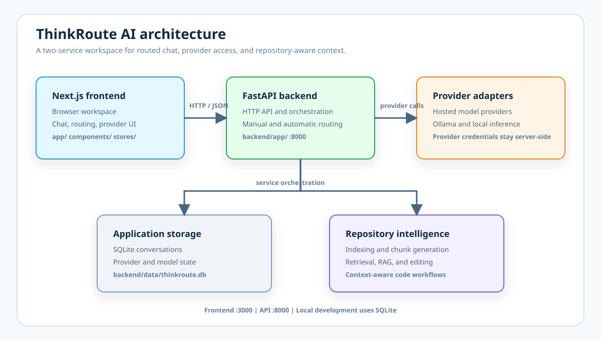

<div align="center">

# ThinkRoute AI

### Route every prompt to the right model, with the right repository context.

ThinkRoute AI is a repository-aware, multi-provider AI workspace for focused engineering conversations.

[](https://nextjs.org/)
[](https://fastapi.tiangolo.com/)
[](https://www.typescriptlang.org/)
[](https://www.python.org/)

[Open the repository](https://github.com/mankudhanush/thinkroute-ai) · [Read the API docs](http://127.0.0.1:8000/docs) · [Report an issue](https://github.com/mankudhanush/thinkroute-ai/issues)

</div>

## At a glance

ThinkRoute AI combines a Next.js workspace with a FastAPI orchestration layer. It connects hosted and local providers, supports manual or intent-aware model selection, stores conversation history, and brings repository context into code-focused chats.

| Capability | What it provides |
| --- | --- |
| **Multi-provider chat** | Connect hosted providers and local Ollama models from one workspace. |
| **Automatic routing** | Select a model using prompt intent and task complexity. |
| **Repository intelligence** | Index, retrieve, and apply code context to RAG workflows. |
| **Conversation history** | Persist local conversations and provider state in SQLite. |

## Contents

- [Architecture](#architecture)
- [Requirements](#requirements)
- [Local setup](#local-setup)
- [Configuration](#configuration)
- [API surface](#api-surface)
- [Development](#development)
- [Documentation](#documentation)
- [Security](#security-and-data-handling)

## Architecture

The application runs as two local services. The main request and data boundaries are shown below:



The diagram is also available as [`docs/architecture.svg`](docs/architecture.svg).

The frontend lives in `app/`, `components/`, `hooks/`, `lib/`, `services/`, `stores/`, and `types/`. The backend and provider adapters live in `backend/app/`. Design proposals and context-engine notes are in `docs/`.

### Technology stack

| Layer | Technologies |
| --- | --- |
| Web application | Next.js, React, TypeScript, Tailwind CSS, Zustand |
| API service | FastAPI, Pydantic, Uvicorn, Python |
| Model access | Provider adapters, hosted APIs, Ollama |
| Persistence | SQLite for local conversation and provider state |
| Repository context | Chunking, indexing, retrieval, RAG, and editing services |

## Requirements

- Node.js 20 or newer and npm
- Python 3.11 or newer
- Credentials for any hosted provider you intend to connect
- Optional: Ollama running locally for local inference and classification

## Local setup

### Frontend

From the repository root:

```powershell
npm install
Copy-Item .env.example .env.local
npm run dev
```

The frontend opens at `http://localhost:3000`. Set `NEXT_PUBLIC_API_URL` in `.env.local` when the API is not at `http://127.0.0.1:8000`.

### Backend

In a second terminal:

```powershell
cd backend
py -3.11 -m venv .venv
.\.venv\Scripts\Activate.ps1
python -m pip install -r requirements.txt
Copy-Item .env.example .env
uvicorn app.main:app --reload
```

The API is available at `http://127.0.0.1:8000`. Health status is exposed at `/health`, and interactive OpenAPI documentation is available at `/docs`.

## Configuration

The frontend only needs `NEXT_PUBLIC_API_URL`:

| Variable | Purpose | Example |
| --- | --- | --- |
| `NEXT_PUBLIC_API_URL` | FastAPI base URL | `http://127.0.0.1:8000` |

Backend settings are documented in [`backend/.env.example`](backend/.env.example):

| Variable | Purpose |
| --- | --- |
| `APP_NAME`, `APP_ENV` | Service name and environment |
| `DATABASE_PATH` | SQLite database location |
| `SECRET_KEY` | Application secret; replace the development value |
| `ENCRYPTION_KEY` | Fernet key used to encrypt stored provider credentials |
| `PROVIDER_TIMEOUT_SECONDS` | Upstream provider request timeout |
| `CORS_ORIGINS` | Comma-separated allowed frontend origins |
| `OLLAMA_BASE_URL` | Ollama server URL |
| `CLOUDFLARE_ACCOUNT_ID` | Cloudflare provider account identifier |

Provider credentials are entered through the provider workflow or configured according to the provider adapter. Never commit credentials, `.env` files, the SQLite database, or generated repository data.

## API surface

| Area | Endpoints |
| --- | --- |
| System | `GET /health` |
| Providers | `GET /providers`, `POST /providers/connect`, `DELETE /providers/{provider}`, `POST /providers/{provider}/refresh_models` |
| Chat | `POST /chat`, `POST /chat/auto`, `GET /chat/history/{conversation_id}` |
| Models | Model discovery and selection routes are grouped under `/models` |
| Repository intelligence | Repository context, chunking, indexing, retrieval, RAG, and editing routes are grouped under their respective routers |

The complete request and response schemas are generated at `http://127.0.0.1:8000/docs` while the backend is running.

## Development

```powershell
# Frontend
npm run dev
npm run typecheck
npm run build

# Backend, from the backend directory with .venv active
python -m pytest
```

The Python test command runs the available backend and integration tests. Install any test-only dependencies required by the tests in the active virtual environment.

Before opening a pull request, run `npm run typecheck` and `npm run build`. Start the backend as well when changing API, provider, routing, or repository-intelligence behavior.

## Security and data handling

- Keep `backend/.env` and `.env.local` local; both are ignored by Git.
- Use a strong, unique `SECRET_KEY` and an explicit Fernet `ENCRYPTION_KEY` outside development.
- Keep `CORS_ORIGINS` limited to trusted frontend origins.
- Provider API keys are handled by the backend and are not returned in provider responses.
- Review repository context and editing permissions before connecting an untrusted workspace.
- `backend/data/`, build output, virtual environments, caches, and local tooling are ignored by Git.

## Documentation

- [Backend setup and API notes](backend/README.md)
- [Context engine proposal](docs/context_engine_proposal.md)
- [Context engine redesign](docs/context-engine-redesign.md)
- [Architecture source image](docs/architecture.svg)

## Contributing

The public repository is available at [github.com/mankudhanush/thinkroute-ai](https://github.com/mankudhanush/thinkroute-ai). Create a focused branch, keep credentials and generated data out of commits, and include the relevant typecheck, build, or backend test results in pull requests.

```powershell
git checkout -b feature/your-change
git add .
git commit -m "Describe the change"
git push -u origin feature/your-change
```

## License

No license has been selected yet. Add a license before accepting external contributions or redistributing the project.